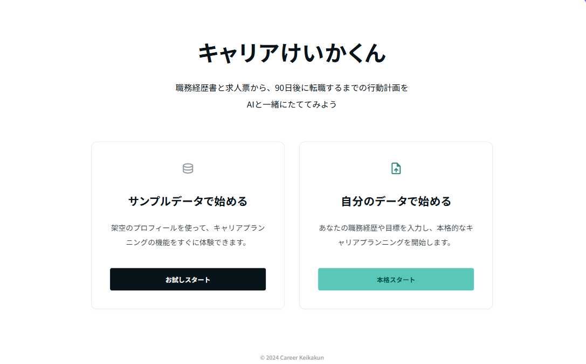

# キャリアけいかくん

職務経歴と求人票を読み込んで、マッチスコア・12週間の準備計画・証拠素材ボードまで返してくれる、日本語ファーストのキャリア準備デモアプリです。

ポートフォリオとして公開しているデモです。現在開発途中です。

## できること

サンプルの職務経歴 + 求人票（BtoB SaaS の CS → Product Operations の想定）で動かすと、以下5画面が触れます。

- **分析**: 求人要件の充足度、スキルマップ、証拠ギャップ、決定論的スコアの内訳
- **プラン**: 12週間分の準備計画（目的と週次タスク）
- **週次レビュー**: 振り返りテキストを構造化し、次アクションに変換
- **証拠ボード**: 計画から生まれた素材の状態管理（作る/進行/完成/アーカイブ）
- **プロセス確認**: パイプラインの各ステップ・プロバイダ呼び出し・監査イベント

LLM 出力に頼らず、スコアや状態遷移は決定論的にコードで計算しています。

## スクリーンショット



## 技術スタック

- Next.js 15 (App Router) / React 19 / TypeScript
- Tailwind CSS
- Zod（プロバイダ出力の契約検証）
- Prisma スキーマ（PostgreSQL 想定、デモはインメモリで動く）
- Vitest（ユニットテスト）
- Playwright（E2E スモーク）
- プロバイダアダプタ: `mock` / `openai` / `anthropic`

## ローカルで動かす

### 前提

- Node.js 22 系（動作確認: v22.17）
- corepack 有効化済み（pnpm を使います）

### 手順

```bash
git clone https://github.com/Ink6x/career-keikakun.git
cd career-keikakun
corepack pnpm install
corepack pnpm dev
```

ブラウザで `http://127.0.0.1:3000` を開き、「サンプルで試す」を選ぶとフルフローが体験できます。API キーは不要です。

## よく使うコマンド

```bash
corepack pnpm check          # 型チェック + Lint
corepack pnpm test           # Vitest ユニットテスト
corepack pnpm build          # 本番ビルド
corepack pnpm test:e2e       # Playwright E2E スモーク
corepack pnpm prisma generate
```

## このリポジトリについて

- **ポートフォリオ用のデモ**で、本番環境にはデプロイしていません
- データベース接続はオプション。デフォルトはプロセス内のインメモリストアで動きます
- 入力した職務経歴・求人票・週次レビューの本文は既定では永続化しません（ハッシュ・要約・構造化結果だけ保存）
- 任意で暗号化済み raw payload を保存する Prisma モデルは用意していますが、`.env` はこのリポジトリでは管理しません

## 設計ドキュメント

詳しい設計の意図はこちらをどうぞ。

- [docs/project-overview.md](docs/project-overview.md) — プロダクトの全体像
- [docs/architecture.md](docs/architecture.md) — 実装シェイプと AI 境界
- [docs/system-design.md](docs/system-design.md) — システム設計の詳細
- [docs/ui-design.md](docs/ui-design.md) — UI 設計
- [docs/schema-design.md](docs/schema-design.md) / [docs/prisma-design.md](docs/prisma-design.md) — データモデル
- [docs/scoring-design.md](docs/scoring-design.md) — スコアリングロジック
- [docs/fixture-design.md](docs/fixture-design.md) — サンプルデータ
- [docs/skill-taxonomy-design.md](docs/skill-taxonomy-design.md) — スキル辞書

## ライセンス

ポートフォリオ用途のため未指定です。商用利用・再配布はご相談ください。
